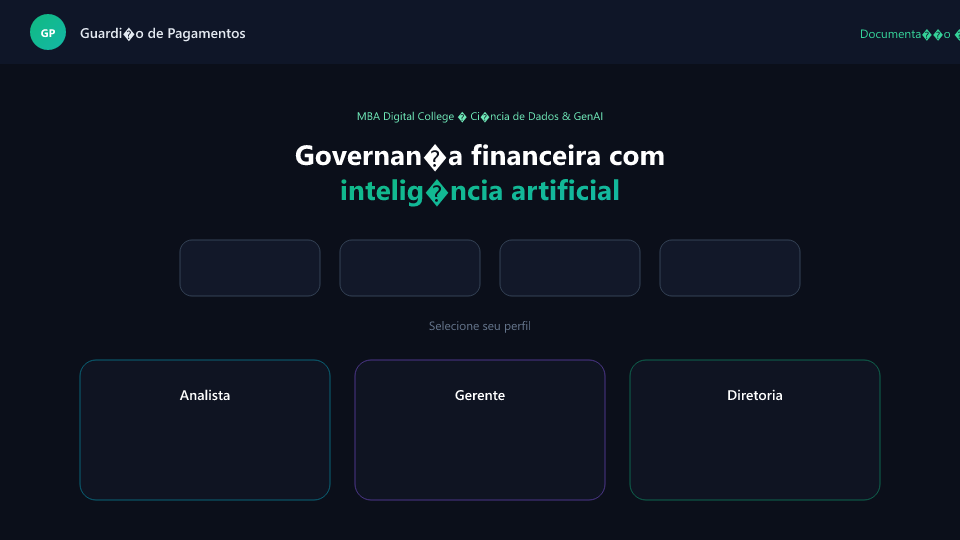

# Guardião de Pagamentos — MBA Digital College

Sistema web de **governança de pagamentos** com dupla aprovação (Analista → Gerente), **detecção de fraudes (XGBoost)**, **parecer GenAI** e dashboard executivo para a Diretoria.



## Documentação completa

| Recurso | Link |
|---------|------|
| Índice da documentação | [`docs/README.md`](docs/README.md) |
| Planejamento | [`docs/01-planejamento.md`](docs/01-planejamento.md) |
| Arquitetura | [`docs/02-arquitetura.md`](docs/02-arquitetura.md) |
| Fluxo de IA | [`docs/03-fluxo-ia.md`](docs/03-fluxo-ia.md) |
| Deploy Netlify | [`docs/04-deploy-netlify.md`](docs/04-deploy-netlify.md) |
| Roteiro de apresentação | [`docs/05-apresentacao.md`](docs/05-apresentacao.md) |
| Guia no app | [`GUIA_UTILIZACAO.md`](GUIA_UTILIZACAO.md) |

## Stack

| Camada | Tecnologia |
|--------|------------|
| Frontend | React 19 + Vite + Tailwind CSS 4 |
| Backend | FastAPI + SQLite |
| ML | XGBoost (`ai_models/detector_fraudes_v1.pkl`) |
| GenAI | Ollama (opcional) ou parecer template |

## Início rápido (local)

### Backend

```powershell
cd backend
python -m venv venv_mba
.\venv_mba\Scripts\activate
pip install -r requirements.txt
cd ..
.\backend\venv_mba\Scripts\python.exe ai_models\train_model.py
cd backend
.\venv_mba\Scripts\uvicorn.exe app.main:app --reload --port 8000
```

API: http://127.0.0.1:8000/docs

### Frontend

```powershell
cd frontend
npm install
npm run dev
```

App: http://localhost:5173

### GenAI (opcional)

```powershell
ollama run llama3:8b
```

## Perfis (demo sem senha)

Na home, escolha o perfil:

| Perfil | Rota | Função |
|--------|------|--------|
| **Analista** | `/analista` | Remessas, anexos, envio IA em lote |
| **Gerente** | `/gerente` | Revisão ML/GenAI, devolução, liberação |
| **Diretoria** | `/diretoria` | KPIs, detecções IA, auditoria |

## Dados de demonstração (6 meses)

Ao subir o backend, o seed carrega automaticamente:

- Cadastros base (contas, fornecedores, colaboradores)
- **~25 remessas** com histórico de ~6 meses
- **~90 pagamentos** com análises IA versionadas
- **1 remessa aguardando gerente** para demo ao vivo

Para resetar lançamentos mantendo cadastros: `POST /api/admin/limpar-lancamentos`  
Para banco zerado: pare o servidor, apague `backend/data/pagamentos.db` e reinicie.

## Fluxo de IA (resumo)

1. Analista adiciona pagamentos **sem** rodar IA
2. No **envio ao gerente**, a API executa heurísticas + XGBoost + GenAI por pagamento
3. Resultados ficam em `Pagamento` e no histórico `PagamentoAnaliseIA`
4. Gerente pode **reanalisar** após correções

Detalhes: [`docs/03-fluxo-ia.md`](docs/03-fluxo-ia.md)

## Deploy Netlify (frontend)

O repositório inclui `netlify.toml`. Configure:

```
VITE_API_URL=https://sua-api-publica.com
```

Passo a passo: [`docs/04-deploy-netlify.md`](docs/04-deploy-netlify.md)

## Estrutura do repositório

```
├── frontend/          # UI React
├── backend/           # API FastAPI
├── ai_models/         # Treino ML
├── docs/              # Documentação + imagens
├── netlify.toml
└── Planejamento_Projeto_Aprovacao_Pagamentos.md
```

## Créditos

Projeto de conclusão — MBA Digital College · Ciência de Dados & GenAI.
