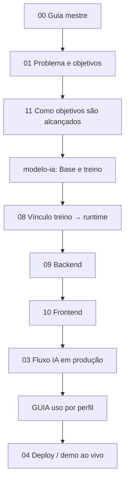

# 00 — Guia mestre da documentação

Mapa para **entender o projeto inteiro**: do treinamento do modelo ao uso do frontend, passando pela construção técnica e pelo alcance dos objetivos de negócio.

---

## Para quem é cada trilha

| Você é… | Comece por | Depois leia |
|---------|------------|-------------|
| **Banca / apresentação MBA** | [01-planejamento](01-planejamento.md) → [05-apresentacao](05-apresentacao.md) | [modelo-ia/08](modelo-ia/08-vinculo-treinamento-e-runtime.md), telas em [README](README.md#telas-do-sistema) |
| **Usuário do sistema** | [GUIA_UTILIZACAO.md](../GUIA_UTILIZACAO.md) | [05-apresentacao](05-apresentacao.md), [07-mapa-dados-demo](07-mapa-dados-demo.md) |
| **Desenvolvedor novo no repo** | [02-arquitetura](02-arquitetura.md) → [09-backend](09-construcao-backend.md) → [10-frontend](10-construcao-frontend.md) | [03-fluxo-ia](03-fluxo-ia.md), [04-deploy-netlify](04-deploy-netlify.md) |
| **Cientista de dados / ML** | [modelo-ia/08](modelo-ia/08-vinculo-treinamento-e-runtime.md) | [01-treinamento](modelo-ia/01-treinamento-do-modelo.md), [03-dicionario](modelo-ia/03-dicionario-de-deteccoes.md) |
| **Produto / comercial** | [comercial-saas/08](comercial-saas/08-plano-disponibilizacao-para-cliente-final.md) | [comercial-saas/](comercial-saas/README.md), [11-objetivos](11-como-objetivos-sao-alcancados.md) |
| **Manutenção da documentação** | [12-indice](12-indice-documentacao.md) | Este guia (00) |
| **Auditor / compliance** | [11-objetivos](11-como-objetivos-sao-alcancados.md) (WORM, dupla aprovação) | [modelo-ia/04](modelo-ia/04-processo-completo-ia.md), [06-catalogo-fraudes](06-catalogo-fraudes.md) |

---

## Trilha completa (ordem sugerida — ~3h de leitura)



| # | Tema | Documento |
|---|------|-----------|
| 1 | Por quê o projeto existe | [01-planejamento](01-planejamento.md) |
| 2 | Objetivo → funcionalidade → evidência | [11-como-objetivos-sao-alcancados](11-como-objetivos-sao-alcancados.md) |
| 3 | Base de dados do ML + treino | [modelo-ia/01](modelo-ia/01-treinamento-do-modelo.md) |
| 4 | Do `.pkl` ao `ml_fraude_detectada` | [modelo-ia/08](modelo-ia/08-vinculo-treinamento-e-runtime.md) |
| 5 | API, serviços, banco | [09-construcao-backend](09-construcao-backend.md) |
| 6 | Telas, rotas, estado | [10-construcao-frontend](10-construcao-frontend.md) |
| 7 | Pipeline IA no envio da remessa | [03-fluxo-ia](03-fluxo-ia.md) + [modelo-ia/04](modelo-ia/04-processo-completo-ia.md) |
| 8 | Como usar Analista / Gerente / Diretoria | [GUIA_UTILIZACAO.md](../GUIA_UTILIZACAO.md) |
| 9 | Publicar e demonstrar | [04-deploy-netlify](04-deploy-netlify.md) + [05-apresentacao](05-apresentacao.md) |

---

## O que já está bem documentado

| Área | Onde | Grau |
|------|------|------|
| Treinamento XGBoost | `modelo-ia/01`, `08` | Alto |
| Atuação do modelo em runtime | `modelo-ia/08`, `04` | Alto |
| Catálogo de detecções | `06-catalogo-fraudes`, `modelo-ia/03` | Alto |
| Fluxo de negócio (3 perfis) | `GUIA`, `05-apresentacao`, assets `06-fluxo` | Alto |
| Deploy Netlify + demo | `04-deploy-netlify`, `07-mapa-dados-demo` | Alto |
| Índice e coerência dos docs | `12-indice-documentacao` | Alto |
| Plano SaaS futuro | `comercial-saas/*` | Alto (produto futuro) |
| Métricas e KPIs demo | `07-mapa-dados-demo`, `modelo-ia/02` | Médio |

---

## O que foi acrescentado para fechar lacunas

| Lacuna anterior | Novo documento |
|-----------------|----------------|
| Navegação única “por onde começo?” | **Este guia (00)** |
| Como o backend foi organizado (pastas, routers) | [09-construcao-backend](09-construcao-backend.md) |
| Como o frontend foi organizado (páginas, API) | [10-construcao-frontend](10-construcao-frontend.md) |
| Objetivo de negócio → código → tela | [11-como-objetivos-sao-alcancados](11-como-objetivos-sao-alcancados.md) |

---

## O que ainda pode evoluir (opcional)

| Item | Sugestão | Prioridade |
|------|----------|------------|
| Vídeo screencast 15 min por perfil | YouTube / pasta `docs/videos/` | Média |
| OpenAPI exportada estática | `docs/api-openapi.md` gerado de `/docs` | Baixa |
| Diagrama ER do banco | `docs/diagrama-er.md` (Mermaid) | Média |
| FAQ de erros comuns | `docs/faq-desenvolvimento.md` | Média |
| Changelog por versão | `CHANGELOG.md` | Baixa |
| Testes automatizados documentados | `docs/testes.md` | Alta (se houver suite) |

---

## Mapa visual da documentação no repositório

```
docs/
├── 00-guia-mestre.md          ← você está aqui
├── 01-planejamento.md
├── 02-arquitetura.md
├── 03-fluxo-ia.md
├── 04-deploy-netlify.md
├── 05-apresentacao.md
├── 06-catalogo-fraudes.md
├── 07-mapa-dados-demo.md
├── 09-construcao-backend.md     ← novo
├── 10-construcao-frontend.md    ← novo
├── 11-como-objetivos-sao-alcancados.md
├── 12-indice-documentacao.md  ← inventário e coerência
├── assets/                    ← screenshots
├── apresentacoes/             ← Pitch Deck PDF
├── modelo-ia/                 ← ML completo
└── comercial-saas/            ← negócio / produção (comece pelo 08)

Raiz:
├── README.md                  ← início rápido
├── GUIA_UTILIZACAO.md         ← manual do usuário
├── scripts/                   ← export demo, verify, screenshots
└── Planejamento_Projeto_*.md  ← documento acadêmico original
```

---

## Perguntas frequentes — qual doc abre?

| Pergunta | Resposta |
|----------|----------|
| De onde veio o modelo? | [modelo-ia/08](modelo-ia/08-vinculo-treinamento-e-runtime.md) §2 |
| Quando a IA roda? | [03-fluxo-ia](03-fluxo-ia.md) — no **envio**, não ao adicionar pagamento |
| Onde está o código do XGBoost? | `ai_models/train_model.py` + `backend/.../fraud_engine.py` |
| Como subo local? | [README.md](../README.md) |
| Como a Diretoria vê fraudes? | [07-mapa-dados-demo](07-mapa-dados-demo.md) |
| Dupla aprovação está onde? | [11-objetivos](11-como-objetivos-sao-alcancados.md) |
| Vender para várias empresas? | [comercial-saas/08](comercial-saas/08-plano-disponibilizacao-para-cliente-final.md) |
| Onde está cada documento? | [12-indice-documentacao](12-indice-documentacao.md) |
| Netlify sem dados completos? | [04-deploy-netlify](04-deploy-netlify.md) — deploy sem cache + `/demoSnapshot.json` |
