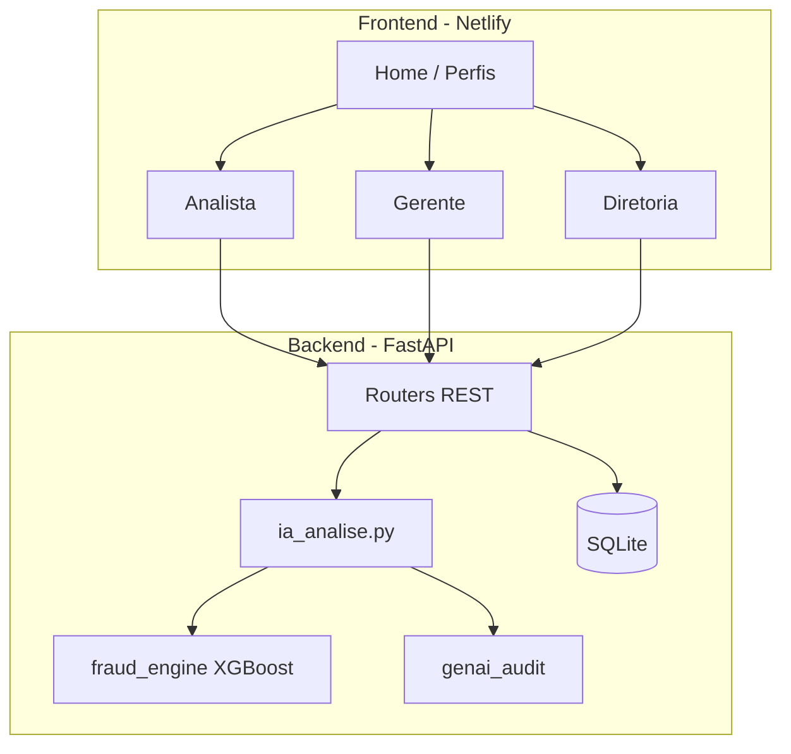

# 02 — Arquitetura



## Repositório

```
trabalho_final_digital_college_mba/
├── frontend/          # React + Vite + Tailwind
├── backend/           # FastAPI + SQLite
├── ai_models/         # Treino e .pkl do XGBoost
├── docs/              # Esta documentação + assets
└── netlify.toml       # Build do frontend
```

## Modelos principais

- `Remessa` — lote de pagamentos com status do fluxo
- `Pagamento` — beneficiário, valor, scores IA atuais
- `PagamentoAnaliseIA` — histórico versionado por reanálise
- `AuditLog` — trilha WORM por perfil

## Perfis e responsabilidades

| Perfil | Ações |
|--------|--------|
| Analista | Cadastros, remessas, anexos, envio IA |
| Gerente | Revisão documental, devolução, liberação |
| Diretoria | KPIs, detecções, pontos de atenção |
