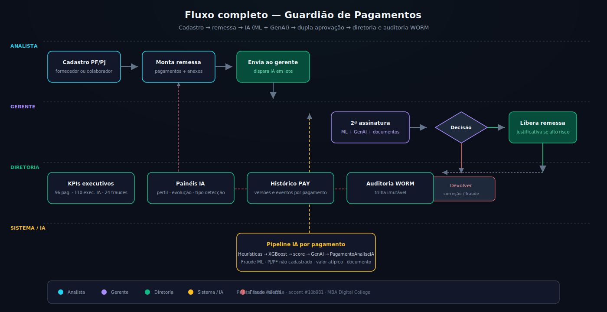
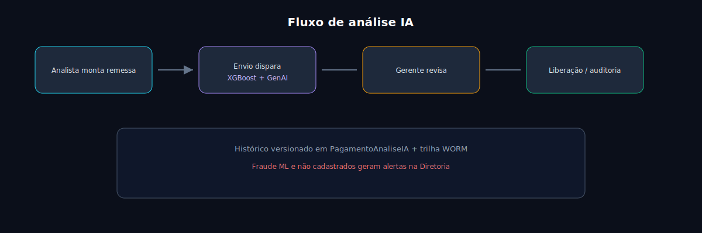

# 03 — Fluxo de Inteligência Artificial





## Quando a IA executa

A IA **não** roda ao adicionar cada pagamento (experiência rápida para o analista).

Ela roda em:

1. **Envio da remessa** ao gerente (`POST /remessas/{id}/enviar`)
2. **Reanálise** solicitada pelo gerente (`POST /remessas/{id}/reanalisar-ia`)

## Pipeline por pagamento

1. **Heurísticas** — valor, velocity, fornecedor não cadastrado, histórico do beneficiário
2. **XGBoost** — `ml_score`, `ml_fraude_detectada`, motivos
3. **Score final** — combinação heurística + ML + conferência documental
4. **GenAI** — parecer de auditoria (Ollama ou template automático)
5. **Persistência** — atualiza `Pagamento` + grava `PagamentoAnaliseIA` (versão N)

## Histórico PAY-XXXXXX

Cada pagamento expõe análises anteriores por `pagamento_id`. Reanálises incrementam `versao` com `triggered_by` (`envio_gerente`, `reanalise_gerente`).

## Diretoria

Endpoint `GET /api/dashboard/deteccoes-ia` lista pagamentos com:

- Fraude ML detectada
- `risk_score` elevado
- Beneficiário não cadastrado

## Treinar o modelo

```powershell
.\backend\venv_mba\Scripts\python.exe ai_models\train_model.py
```

Gera `ai_models/detector_fraudes_v1.pkl` usado em runtime.
