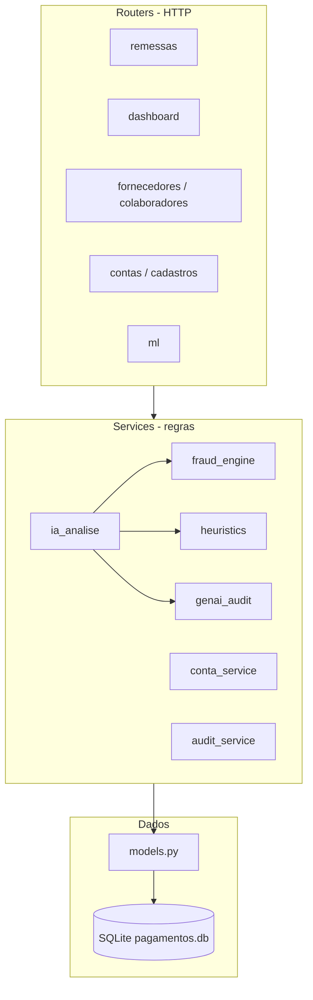

# 09 — Construção do backend (FastAPI)

Como a API foi estruturada, como os módulos se conectam e onde a IA é acionada.

---

## Visão em camadas



---

## Ponto de entrada

| Arquivo | Função |
|---------|--------|
| `backend/app/main.py` | Cria app FastAPI, CORS, registra routers, lifespan (seed) |
| `backend/app/database.py` | Engine SQLAlchemy, sessão `get_db`, migrações leves |
| `backend/app/schemas.py` | Pydantic — request/response da API |

**Swagger:** `http://127.0.0.1:8000/docs`

---

## Routers (endpoints REST)

| Router | Prefixo | Responsabilidade |
|--------|---------|------------------|
| `remessas.py` | `/api/remessas` | Ciclo de vida da remessa, **envio IA**, liberação, devolução |
| `pagamentos.py` | `/api/pagamentos` | Detalhe, anexos, download |
| `fornecedores.py` | `/api/fornecedores` | CRUD, ativos, aprovação gerente |
| `colaboradores.py` | `/api/colaboradores` | CRUD RH |
| `contas.py` | `/api/contas` | Saldos, movimentos, crédito |
| `cadastros.py` | `/api/cadastros` | Solicitações de alteração |
| `dashboard.py` | `/api/dashboard` | KPIs, gráficos, detecções, auditoria |
| `ml.py` | `/api/ml` | Status do modelo, validação pontual |

### Endpoints críticos para a IA

| Método | Rota | O que dispara |
|--------|------|----------------|
| POST | `/api/remessas/{id}/enviar` | `analisar_remessa_completa(..., "envio_gerente")` |
| POST | `/api/remessas/{id}/reanalisar-ia` | `analisar_remessa_completa(..., "reanalise_gerente")` |
| GET | `/api/ml/status` | `fraud_engine.status_modelo()` |

---

## Services (lógica de negócio)

| Service | Papel |
|---------|--------|
| **`ia_analise.py`** | Orquestra pipeline IA por pagamento e por remessa |
| **`fraud_engine.py`** | Carrega `.pkl`, extrai features, `predict_proba`, motivos |
| **`heuristics.py`** | Benford, velocity, limites de valor |
| **`genai_audit.py`** | Parecer LLM (Ollama) ou template |
| **`fraud_detector.py`** | `score_final()` — combina heurística + ML + documento |
| **`conta_service.py`** | Débito na liberação, verificação de saldo |
| **`audit_service.py`** | Registro WORM em `audit_logs` |
| **`documentos.py`** | Validação e storage de anexos |
| **`dashboard_ia_metrics.py`** | Agregações para gráficos Diretoria |
| **`dashboard_historico.py`** | Histórico PAY + eventos |
| **`pagamento_out.py`** | Monta DTO de pagamento para o frontend |
| **`cadastro_historico.py`** | Alertas de cadastro na IA |

---

## Modelos de dados (`models.py`)

| Entidade | Papel no objetivo |
|----------|-------------------|
| `Remessa` | Lote; status do fluxo; `analise_ia_concluida` |
| `Pagamento` | Valor, beneficiário, scores IA atuais |
| `PagamentoAnaliseIA` | Histórico versionado de cada análise |
| `AuditLog` | Trilha imutável |
| `ContaBancaria` | Saldo para feature `valor_sobre_saldo` |
| `Fornecedor` / `Colaborador` | Whitelist / RH |

---

## Seed e dados de demonstração

| Script | Quando roda | Conteúdo |
|--------|-------------|----------|
| `seed.py` | Startup API | Cadastros base + chama histórico e catálogo |
| `seed_demo_historico.py` | Via seed | ~6 meses de remessas |
| `seed_cenarios_fraude.py` | Via seed | Remessa catálogo MBA |
| `seed_auditoria.py` | Via seed | Enriquece reanálises gerente |

Recriar banco: apagar `backend/data/pagamentos.db` e reiniciar.

---

## Fluxo de uma requisição “enviar remessa”

```text
POST /api/remessas/26/enviar
  → remessas.enviar_gerente()
  → analisar_remessa_completa(db, remessa)
       → para cada Pagamento:
            executar_analise_ia_pagamento()
              → regras_heuristicas()
              → analisar_fraude()  ← XGBoost
              → score_final()
              → gerar_parecer_auditoria()
              → INSERT PagamentoAnaliseIA
              → UPDATE Pagamento
  → remessa.status = aguardando_gerente
  → commit
```

Detalhe: [modelo-ia/08](modelo-ia/08-vinculo-treinamento-e-runtime.md).

---

## Configuração e variáveis

| Variável | Uso |
|----------|-----|
| `OLLAMA_URL` / `OLLAMA_MODEL` | GenAI real |
| Caminho `.pkl` | Fixo em `fraud_engine.MODEL_PATH` |

---

## Como estender o backend

| Necessidade | Onde alterar |
|-------------|--------------|
| Nova regra de fraude | `heuristics.py` ou `fraud_engine.analisar_fraude` |
| Novo endpoint | Novo router + schema |
| Novo KPI | `dashboard_ia_metrics.py` |
| Multi-tenant | Ver [comercial-saas/03](comercial-saas/03-arquitetura-multi-cliente-e-infraestrutura.md) |

---

## Relacionados

- [02-arquitetura](02-arquitetura.md)
- [10-construcao-frontend](10-construcao-frontend.md)
- [03-fluxo-ia](03-fluxo-ia.md)
