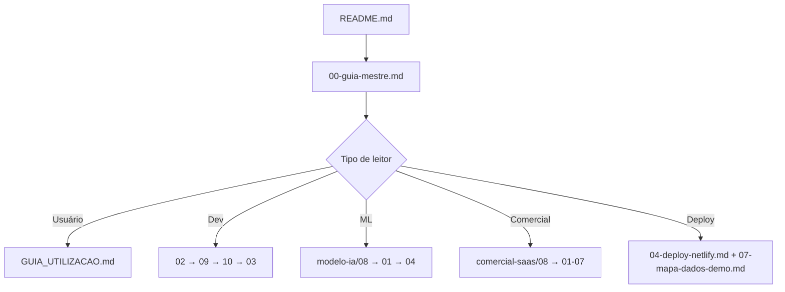

# 12 — Índice e coerência da documentação

Inventário oficial de toda a documentação do repositório, com **público-alvo**, **status** e **regras de coerência** entre documentos.

> Navegação rápida: [00 — Guia mestre](00-guia-mestre.md) · [README da pasta docs](README.md)

---

## 1. Mapa completo de arquivos

### Raiz do repositório

| Arquivo | Público | Conteúdo |
|---------|---------|----------|
| [README.md](../README.md) | Todos | Início rápido, stack, links principais |
| [GUIA_UTILIZACAO.md](../GUIA_UTILIZACAO.md) | Usuário final | Manual Analista / Gerente / Diretoria |
| [Planejamento_Projeto_Aprovacao_Pagamentos.md](../Planejamento_Projeto_Aprovacao_Pagamentos.md) | Acadêmico | Documento original do MBA |

### `docs/` — documentação técnica e operacional

| # | Arquivo | Público | Tema |
|---|---------|---------|------|
| 00 | [00-guia-mestre.md](00-guia-mestre.md) | Todos | Trilhas de leitura por perfil |
| 01 | [01-planejamento.md](01-planejamento.md) | Banca / produto | Objetivo, escopo, cronograma |
| 02 | [02-arquitetura.md](02-arquitetura.md) | Dev | Stack, camadas, dados |
| 03 | [03-fluxo-ia.md](03-fluxo-ia.md) | Dev / ML | Pipeline IA no envio |
| 04 | [04-deploy-netlify.md](04-deploy-netlify.md) | Dev / ops | Deploy frontend, modo demo |
| 05 | [05-apresentacao.md](05-apresentacao.md) | Apresentador | Roteiro demo 20 min |
| 06 | [06-catalogo-fraudes.md](06-catalogo-fraudes.md) | Dev / auditoria | Cenários ML/heurística |
| 07 | [07-mapa-dados-demo.md](07-mapa-dados-demo.md) | Demo / QA | KPIs, seed, paridade Netlify |
| 09 | [09-construcao-backend.md](09-construcao-backend.md) | Dev | Routers, services, seed |
| 10 | [10-construcao-frontend.md](10-construcao-frontend.md) | Dev | React, API client, demo |
| 11 | [11-como-objetivos-sao-alcancados.md](11-como-objetivos-sao-alcancados.md) | Banca / produto | Objetivo → código → tela |
| 12 | **Este arquivo** | Mantenedor | Índice e regras de coerência |

### `docs/modelo-ia/` — machine learning

| # | Arquivo | Tema |
|---|---------|------|
| — | [README.md](modelo-ia/README.md) | Índice ML |
| 01 | [01-treinamento-do-modelo.md](modelo-ia/01-treinamento-do-modelo.md) | Dataset, retreino |
| 02 | [02-resultados-e-metricas.md](modelo-ia/02-resultados-e-metricas.md) | F1, AUC, KPIs demo |
| 03 | [03-dicionario-de-deteccoes.md](modelo-ia/03-dicionario-de-deteccoes.md) | Campos e códigos |
| 04 | [04-processo-completo-ia.md](modelo-ia/04-processo-completo-ia.md) | Pipeline ponta a ponta |
| 05 | [05-mapa-de-nomenclaturas.md](modelo-ia/05-mapa-de-nomenclaturas.md) | Glossário |
| 08 | [08-vinculo-treinamento-e-runtime.md](modelo-ia/08-vinculo-treinamento-e-runtime.md) | `.pkl` → runtime |

### `docs/comercial-saas/` — negócio e produção

| # | Arquivo | Tema |
|---|---------|------|
| — | [README.md](comercial-saas/README.md) | Índice comercial |
| 01–07 | 01 a 07 | Visão, preços, infra, LGPD, suporte, roadmap, implantação |
| 08 | [08-plano-disponibilizacao-para-cliente-final.md](comercial-saas/08-plano-disponibilizacao-para-cliente-final.md) | **Plano mestre B2B** |

### `docs/apresentacoes/`

| Arquivo | Uso |
|---------|-----|
| [Guardiao-de-Pagamentos-Pitch-Deck.pdf](apresentacoes/Guardiao-de-Pagamentos-Pitch-Deck.pdf) | Pitch comercial / MBA |

### `docs/assets/`

Screenshots (`01-home.png` … `06-fluxo-completo.png`) e SVGs fonte — referenciados em [docs/README.md](README.md#telas-do-sistema).

### Scripts relacionados à documentação

| Script | Função |
|--------|--------|
| `scripts/export_demo_snapshot.py` | Gera `frontend/public/demoSnapshot.json` |
| `scripts/verify_demo_parity.py` | Valida KPIs 96/110/24 |
| `scripts/capture_doc_screenshots.mjs` | Regenera PNGs das telas |
| `scripts/regenerate_doc_assets.ps1` | Pipeline de assets visuais |

---

## 2. Números oficiais da demonstração (usar em todos os docs)

Valores após `reseed_demo.py` ou Netlify com snapshot carregado:

| Indicador | Valor |
|-----------|-------|
| Remessas (seed) | **27** |
| Pagamentos analisados (IA) — Diretoria | **96** |
| Execuções IA | **110** |
| Fraudes ML | **24** |
| PJ não cadastrados | **9** |
| PF não cadastradas | **6** |
| Valor analisado (histórico) | ~**R$ 5,81 mi** |
| Saldo total contas | **R$ 2.125.000** |

**Não usar** aproximações antigas (~90 pagamentos, ~25 remessas sem qualificar KPIs).

---

## 3. Regras de coerência (obrigatórias)

### Modo demo (Netlify)

| Regra | Valor correto |
|-------|----------------|
| Arquivo de dados | `frontend/public/demoSnapshot.json` |
| URL em produção | `/demoSnapshot.json` |
| Carregamento | Runtime em `main.tsx` → `initDemoSnapshot()` |
| Mock de API | `demoResolver.ts` (não “dados estáticos hardcoded”) |
| Validação no build | `npm run demo:verify` (via `netlify.toml`) |
| Confirmação visual | Header: `Demo 96 pag. · 110 IA · 24 fraudes` |

### Quando a IA executa

Sempre documentar: IA roda no **envio da remessa ao gerente**, não ao adicionar pagamento individual.

Referência canônica: [03-fluxo-ia.md](03-fluxo-ia.md), [GUIA_UTILIZACAO.md](../GUIA_UTILIZACAO.md).

### Deploy Netlify padrão do repositório

- `VITE_DEMO_MODE=true` em `netlify.toml`
- **Não** exigir `VITE_API_URL` para demo pública
- Se `VITE_API_URL` estiver definido no painel Netlify, o backend passa a ser obrigatório

### Pitch e material acadêmico

- Pitch versionado: `docs/apresentacoes/Guardiao-de-Pagamentos-Pitch-Deck.pdf`
- PDF do módulo GenAI da faculdade **não** faz parte do repo (`.gitignore`)

---

## 4. Hierarquia de leitura recomendada

---

## 5. Checklist de manutenção (ao alterar o código)

- [ ] KPIs mudaram no seed? → `python scripts/export_demo_snapshot.py` + commit do JSON
- [ ] `npm run demo:verify` passa no frontend
- [ ] Atualizar [07-mapa-dados-demo.md](07-mapa-dados-demo.md) e [modelo-ia/02](modelo-ia/02-resultados-e-metricas.md)
- [ ] Screenshots desatualizados? → `scripts/regenerate_doc_assets.ps1`
- [ ] Novo endpoint? → [modelo-ia/03](modelo-ia/03-dicionario-de-deteccoes.md) + [09-backend](09-construcao-backend.md)

---

## 6. Documentos por objetivo (busca rápida)

| Preciso… | Abrir |
|----------|-------|
| Apresentar na banca | 05-apresentacao, Pitch PDF, docs/assets |
| Subir local | README, 09, 10 |
| Publicar Netlify | 04-deploy-netlify |
| Vender para empresas | comercial-saas/08 |
| Entender fraude ML | modelo-ia/08, 06-catalogo-fraudes |
| LGPD / contrato | comercial-saas/04 |
| Corrigir KPI errado na demo | 07, export_demo_snapshot |

---

*Última revisão de coerência: alinhada ao commit com `demoSnapshot.json` em `public/`, KPIs 96/110/24 e plano comercial 08.*
