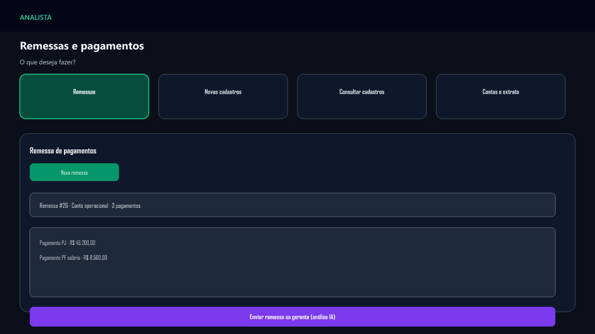
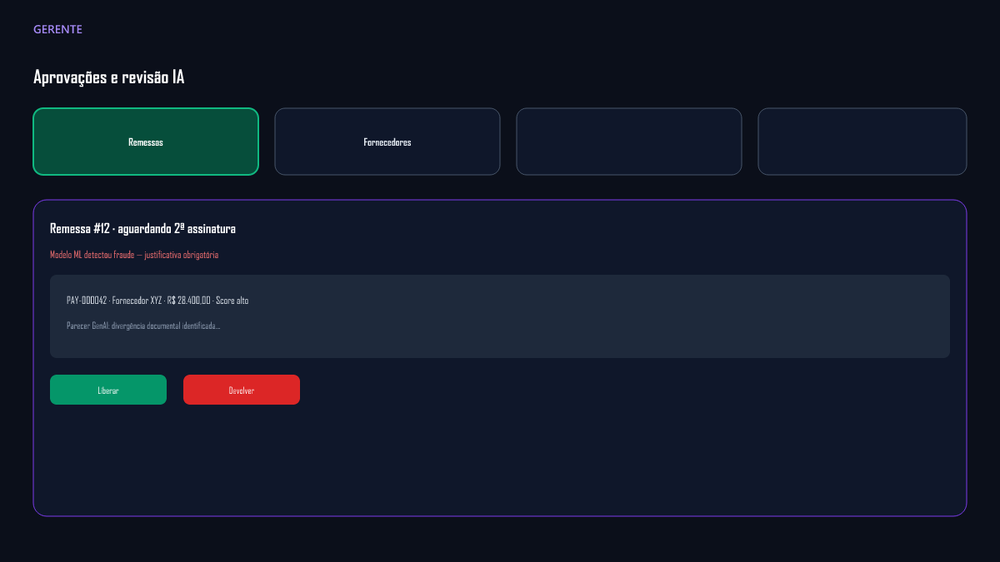
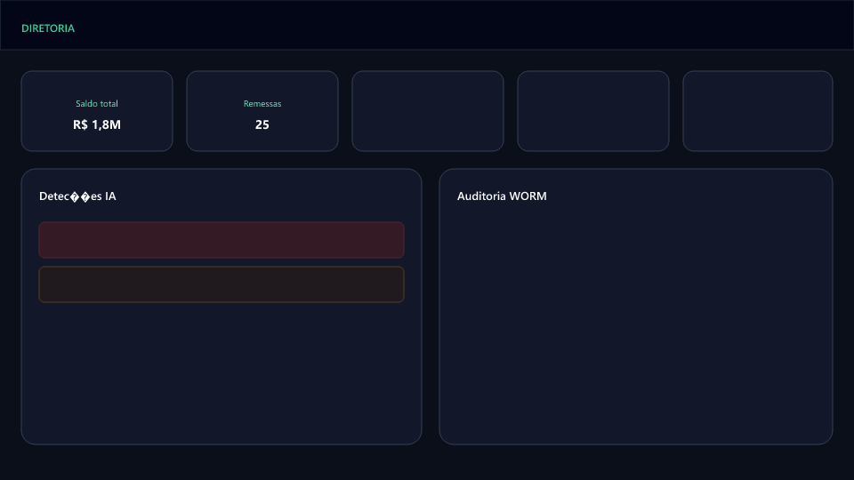
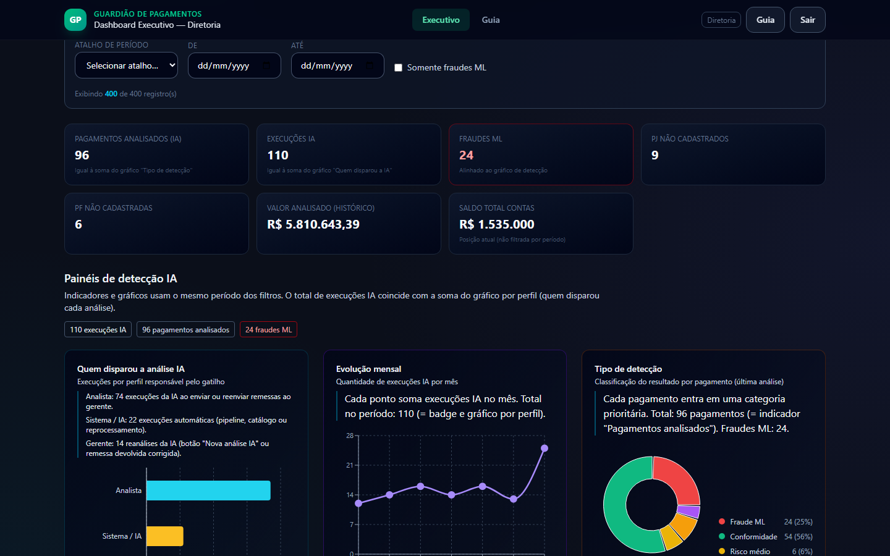
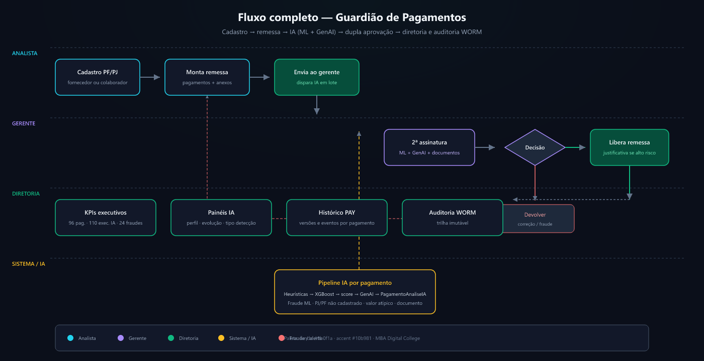

# Documentação — Guardião de Pagamentos

Índice do projeto MBA Digital College com passo a passo de implementação, fluxo de IA e deploy.

> **Comece aqui:** [00 — Guia mestre](00-guia-mestre.md) — trilhas por perfil (banca, dev, usuário, ML) e mapa de toda a documentação.

## Conteúdo

| Documento | Descrição |
|-----------|-----------|
| [**00 — Guia mestre**](00-guia-mestre.md) | Navegação completa e trilhas de leitura |
| [01 — Planejamento](01-planejamento.md) | Objetivo, escopo e cronograma |
| [02 — Arquitetura](02-arquitetura.md) | Stack, camadas e modelos de dados |
| [03 — Fluxo de IA](03-fluxo-ia.md) | ML (XGBoost) + GenAI no envio da remessa |
| [04 — Deploy Netlify](04-deploy-netlify.md) | Publicar frontend e conectar API |
| [05 — Apresentação](05-apresentacao.md) | Roteiro de demo nos 3 perfis |
| [06 — Catálogo de fraudes](06-catalogo-fraudes.md) | Todos os cenários ML/heurística/GenAI |
| [07 — Mapa de dados demo](07-mapa-dados-demo.md) | Onde ver histórico, fraudes e saldos por perfil |
| [09 — Construção backend](09-construcao-backend.md) | Routers, services, fluxo enviar remessa |
| [10 — Construção frontend](10-construcao-frontend.md) | Páginas, componentes, API client |
| [11 — Objetivos alcançados](11-como-objetivos-sao-alcancados.md) | Problema → funcionalidade → código → validação |

### Plano comercial e operação SaaS

Pasta dedicada: **[comercial-saas/](comercial-saas/README.md)** — negócio, infra multi-cliente, segurança, suporte, treinamento e implantação.

### Documentação do modelo de IA

Pasta dedicada: **[modelo-ia/](modelo-ia/README.md)**

| Documento | Conteúdo |
|-----------|----------|
| [Treinamento](modelo-ia/01-treinamento-do-modelo.md) | Dataset, features, retreino XGBoost |
| [Resultados](modelo-ia/02-resultados-e-metricas.md) | F1, AUC, métricas da demo |
| [Dicionário](modelo-ia/03-dicionario-de-deteccoes.md) | Códigos, campos, endpoints |
| [Processo completo](modelo-ia/04-processo-completo-ia.md) | Pipeline no dia a dia |
| [Mapa de nomenclaturas](modelo-ia/05-mapa-de-nomenclaturas.md) | Glossário e gráficos |
| [**Vínculo treino → runtime**](modelo-ia/08-vinculo-treinamento-e-runtime.md) | Base de treino, `.pkl` e atuação no sistema |

## Telas do sistema

> Imagens **PNG** para o GitHub (acentuação correta em UTF-8). Fonte editável: `assets/*.svg`. Para regerar: `npx @resvg/resvg-js-cli --fit-width 1200 assets/NOME.svg assets/NOME.png` na pasta `docs`.

| Tela | Preview |
|------|---------|
| Home — seleção de perfil |  |
| Analista |  |
| Gerente + IA |  |
| Diretoria — KPIs |  |
| Painéis de detecção IA |  |
| Fluxo completo do processo |  |

> Screenshots `01`–`05`: captura real da UI (`node scripts/capture_doc_screenshots.mjs`).  
> `06-fluxo-completo`: diagrama em SVG (`assets/06-fluxo-completo.svg`) — regerar PNG com `scripts/regenerate_doc_assets.ps1`.

## Dados de demonstração

Ao iniciar o backend, o seed carrega:

- 3 contas bancárias, 11 fornecedores, 10 colaboradores
- **~6 meses** de remessas (25+), pagamentos, histórico `PagamentoAnaliseIA` e trilha de auditoria
- 1 remessa **aguardando gerente** para demo ao vivo

Para recriar do zero: apague `backend/data/pagamentos.db` (com o servidor parado) e reinicie a API.
