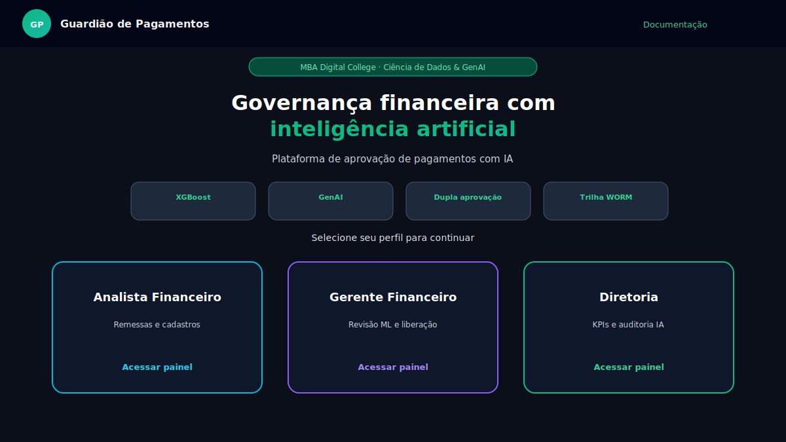
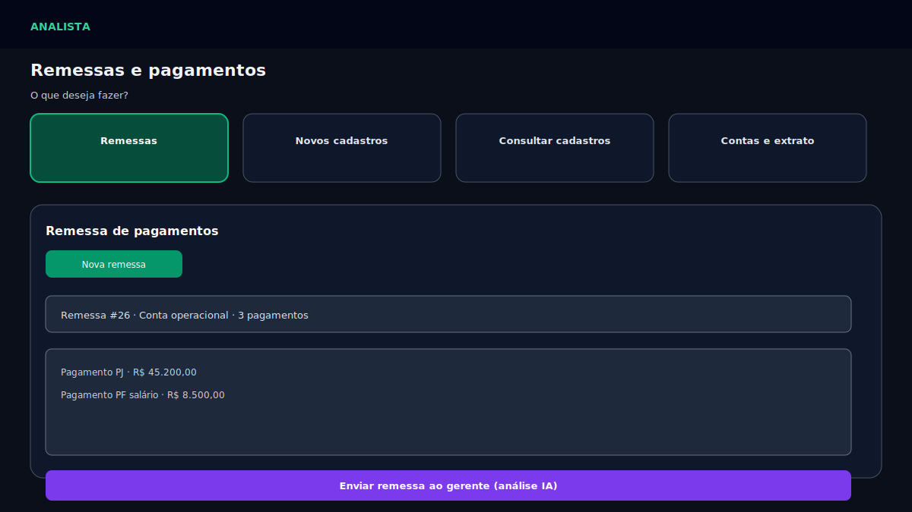
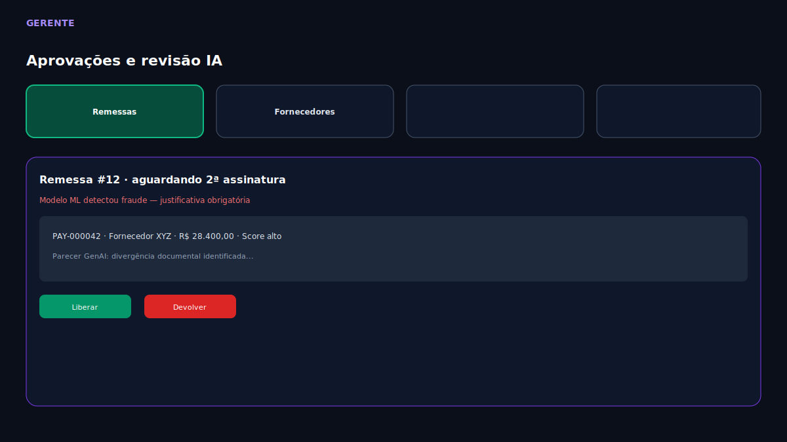

# Documentação — Guardião de Pagamentos

Índice do projeto MBA Digital College com passo a passo de implementação, fluxo de IA e deploy.

## Conteúdo

| Documento | Descrição |
|-----------|-----------|
| [01 — Planejamento](01-planejamento.md) | Objetivo, escopo e cronograma |
| [02 — Arquitetura](02-arquitetura.md) | Stack, camadas e modelos de dados |
| [03 — Fluxo de IA](03-fluxo-ia.md) | ML (XGBoost) + GenAI no envio da remessa |
| [04 — Deploy Netlify](04-deploy-netlify.md) | Publicar frontend e conectar API |
| [05 — Apresentação](05-apresentacao.md) | Roteiro de demo nos 3 perfis |
| [06 — Catálogo de fraudes](06-catalogo-fraudes.md) | Todos os cenários ML/heurística/GenAI |
| [07 — Mapa de dados demo](07-mapa-dados-demo.md) | Onde ver histórico, fraudes e saldos por perfil |

## Telas do sistema

## Dados de demonstração

Ao iniciar o backend, o seed carrega:

- 3 contas bancárias, 11 fornecedores, 10 colaboradores
- **~6 meses** de remessas (25+), pagamentos, histórico `PagamentoAnaliseIA` e trilha de auditoria
- 1 remessa **aguardando gerente** para demo ao vivo

Para recriar do zero: apague `backend/data/pagamentos.db` (com o servidor parado) e reinicie a API.
