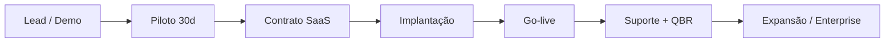

# 01 — Visão e proposta de valor

## O que você está vendendo

**Guardião de Pagamentos** é uma plataforma de **governança de contas a pagar** com:

- Dupla aprovação (Analista → Gerente → visão Diretoria)
- IA assistiva no envio da remessa (heurísticas + XGBoost + parecer GenAI)
- Trilha de auditoria imutável (WORM)
- KPIs e detecções para CFO/Compliance

Não é um ERP completo nem um internet banking — é a **camada de controle e IA** antes do dinheiro sair.

## Cliente ideal (ICP)

| Critério | Perfil |
|----------|--------|
| Porte | 50–500 funcionários; tesouraria com 2–10 pessoas |
| Volume | 20–500 pagamentos/mês (PIX/TED/fornecedores/folha) |
| Dor | Fraude, beneficiário não cadastrado, planilha+e-mail, auditoria reativa |
| Maturidade | Já usa ERP ou banco corporativo; aceita SaaS cloud |
| Decisor | CFO, Controller, Gerente de tesouraria |

## Proposta de valor por stakeholder

| Stakeholder | Ganho |
|-------------|--------|
| **Analista** | Remessas em lote, anexos guiados, menos retrabalho após devolução |
| **Gerente** | Score ML + parecer + histórico por pagamento; justificativa rastreável |
| **Diretoria** | Painel único: fraudes, não cadastrados, valor analisado, trilha |
| **Compliance** | WORM, segregação de funções, evidência para auditoria externa |
| **TI** | API REST, SSO (roadmap), sem substituir ERP |

## Diferenciais competitivos

1. **IA no momento certo** — não a cada clique; no envio (performance + consistência).
2. **Explicabilidade** — motivos ML + flags heurísticas + parecer GenAI.
3. **Humano no loop** — copiloto, não pagamento autônomo.
4. **Métricas coerentes** — KPIs, gráficos e histórico na mesma base.
5. **Catálogo de detecções** — fraude ML, PJ/PF não cad., velocity, documento, etc.

## Posicionamento de mensagem

> *"Pagamentos seguros. Decisões rápidas. Auditoria que não se perde."*

Evitar prometer “100% anti-fraude”. Vender **camada adicional de governança e detecção**.

## Canais de aquisição

| Canal | Ação |
|-------|------|
| Indicação contábil/consultoria | Parceiros que auditam AP |
| LinkedIn / conteúdo | Casos de fraude em AP, LGPD, IA responsável |
| Demo 20 min | Home → Analista → Gerente → Diretoria (roteiro em [05-apresentacao.md](../05-apresentacao.md)) |
| Piloto 30 dias | Até 100 pagamentos/mês, implantação assistida |
| Eventos MBA / fintech | Credibilidade acadêmica + produto funcional |

## Jornada do cliente

