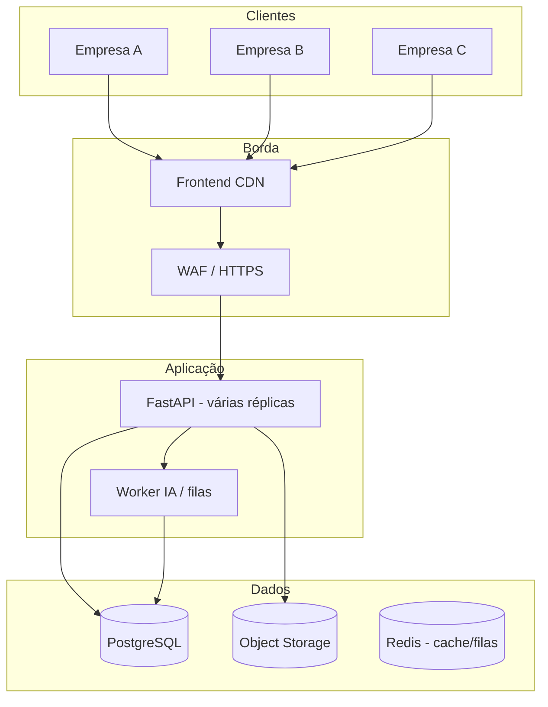

# 03 — Arquitetura multi-cliente e infraestrutura

## Situação atual vs. produção

| Aspecto | MVP hoje | Produção multi-cliente |
|---------|----------|------------------------|
| Banco | SQLite (arquivo único) | **PostgreSQL** gerenciado |
| Tenants | Um ambiente | **`tenant_id` em todas as tabelas** |
| Autenticação | Perfil em `localStorage` | **JWT + SSO** (opcional Enterprise) |
| Anexos | Disco local | **S3-compatible** (AWS S3, R2, MinIO) |
| GenAI | Ollama local / template | API gerenciada ou Ollama por tenant |
| Deploy | Netlify + API opcional | CI/CD + ambientes staging/prod |

## Modelo multi-tenant recomendado

**Shared database, shared schema** com coluna `tenant_id` — melhor custo/benefício para início.

### Regras de isolamento

1. Todo query ORM filtra `tenant_id` (middleware injeta do JWT).
2. Testes automatizados garantem **vazamento zero** entre tenants.
3. Backups por tenant ou restore lógico com `tenant_id`.
4. Limites de rate por tenant (pagamentos/mês do plano).

## Stack de produção sugerida

| Camada | Opção 1 (rápida) | Opção 2 (escala) |
|--------|------------------|------------------|
| Frontend | Netlify / Vercel | CloudFront + S3 |
| API | Render / Railway | AWS ECS / Fly.io |
| Banco | Supabase / Neon / RDS | RDS PostgreSQL Multi-AZ |
| Filas | Redis (Upstash) | SQS + worker |
| Anexos | Cloudflare R2 | AWS S3 + KMS |
| Secrets | Doppler / Vault | AWS Secrets Manager |
| Logs | Axiom / Datadog | CloudWatch + OpenSearch |
| IA batch | Worker no envio remessa | Mesma fila assíncrona |

## Armazenamento de dados

### Dados transacionais (PostgreSQL)

| Domínio | Tabelas principais | Retenção sugerida |
|---------|-------------------|-------------------|
| Operacional | remessas, pagamentos, cadastros | Vitalício do contrato |
| IA | pagamento_analises_ia | Vitalício (auditoria) |
| Compliance | audit_logs (WORM lógico) | 5–10 anos (setor financeiro) |
| Admin | tenants, users, planos, billing | Vitalício + logs |

### Anexos (object storage)

- Caminho: `s3://bucket/{tenant_id}/pagamentos/{id}/{arquivo}`
- Criptografia **SSE-S3 ou SSE-KMS**
- Antivírus opcional (ClamAV no upload)
- Tamanho máximo por arquivo (ex.: 10 MB) e por remessa

### Modelo ML

- `detector_fraudes_v1.pkl` global **ou** por tenant (Enterprise)
- Metadados em `model_metadata.json` versionado
- Retreino agendado com dados anonimizados do cliente (opt-in contratual)

## Ambientes

| Ambiente | Uso |
|----------|-----|
| **dev** | Desenvolvimento local |
| **staging** | Homologação do cliente antes go-live |
| **prod** | Produção |

Cada ambiente: banco separado, secrets separados, `VITE_API_URL` apontando para API correta.

## Escalabilidade

| Gatilho | Ação |
|---------|------|
| > 50 tenants | Read replica PostgreSQL |
| IA lenta no envio | Fila assíncrona: envio → 202 Accepted → notifica gerente |
| Pico 9h–11h | Auto-scale API (2–5 instâncias) |
| > 1 TB anexos | Lifecycle S3 → Glacier após 2 anos |

## Disponibilidade (SLA)

| Plano | Uptime alvo | Janela manutenção |
|-------|-------------|-------------------|
| Starter / Pro | melhor esforço | Notificação 48h |
| Enterprise | 99,5% mensal | Domingo 02h–06h |

Monitorar: `/api/health`, latência p95, taxa de erro 5xx, fila IA.

## Disaster recovery

- Backup PostgreSQL: **diário** automático + PITR se disponível
- RPO alvo: 24h (Starter), 1h (Enterprise)
- RTO alvo: 4h (Starter), 1h (Enterprise)
- Runbook documentado: restore DB + redeploy API + validação smoke test

## Integrações futuras (ERP / banco)

| Integração | Direção | Prioridade |
|------------|---------|------------|
| Export CSV remessas liberadas | Saída | Alta |
| Webhook `remessa.liberada` | Saída | Alta |
| Import fornecedores ERP | Entrada | Média |
| SSO Azure AD / Google | Auth | Enterprise |
| API pagamentos (banco) | Saída | Longo prazo — compliance forte |
