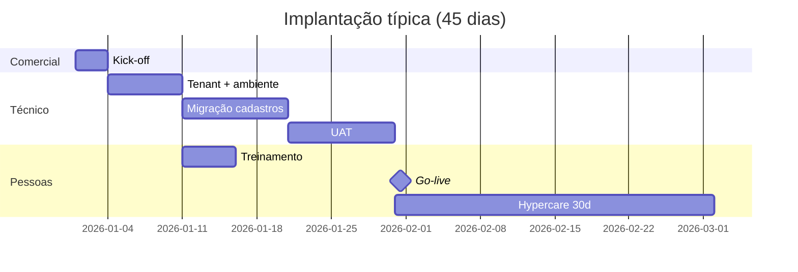

# 07 — Implantação por cliente (checklist 30–60 dias)

Roteiro padrão do **contrato assinado** ao **go-live** em produção.

## Visão do cronograma

## Semana 1 — Kick-off e descoberta

| # | Atividade | Responsável | Entregável |
|---|-----------|-------------|------------|
| 1 | Reunião kick-off (decisor + TI + tesouraria) | CS | Ata |
| 2 | Mapear fluxo AP atual (alçadas, ERP, volume) | CS | Diagrama AS-IS |
| 3 | Definir usuários por perfil (nomes, e-mails) | Cliente | Planilha |
| 4 | Assinar DPA e Termos | Jurídico | PDF arquivado |
| 5 | Criar tenant staging + prod | Tech | URLs |
| 6 | Configurar `VITE_API_URL` e secrets | Tech | Deploy OK |

## Semana 2 — Configuração técnica

| # | Atividade | Entregável |
|---|-----------|------------|
| 7 | Import fornecedores/colaboradores (CSV) | Cadastros ativos |
| 8 | Configurar contas bancárias e saldos iniciais | 1–3 contas |
| 9 | Ajustar limiar ML se necessário (setor) | Documento config |
| 10 | Testar envio remessa + IA em staging | 3 remessas teste |
| 11 | Validar parecer GenAI (Ollama ou template) | Aprovação cliente |
| 12 | Treinamento M2 Analista + M3 Gerente | Lista presença |

## Semana 3–4 — UAT (homologação)

| # | Cenário UAT | Resultado esperado |
|---|-------------|-------------------|
| 13 | Remessa conforme (fornecedor cadastrado) | Risco baixo, liberação OK |
| 14 | PJ não cadastrado | Alerta + justificativa se liberar |
| 15 | Valor alto / fraude ML simulada | Badge ALTO + motivos |
| 16 | Devolução ao analista | Status `devolvida_analista` |
| 17 | Reenvio após correção | Nova versão IA |
| 18 | Diretoria — filtros e KPIs | Números coerentes |
| 19 | Export auditoria | CSV/PDF com trilha |
| 20 | Treinamento M4 Diretoria | Concluído |

**Critério go/no-go:** cliente assina termo UAT.

## Semana 5 — Go-live

| # | Atividade |
|---|-----------|
| 21 | Migrar usuários para produção |
| 22 | Comunicado interno (e-mail CFO) |
| 23 | Primeira remessa real acompanhada (war room 2h) |
| 24 | Ativar monitoramento e alertas |
| 25 | Handover para suporte N1 |

## Hypercare (30 dias pós go-live)

| Semana | Ação |
|--------|------|
| 1 | Daily check-in 15 min (opcional) |
| 2 | Revisão tickets e dúvidas |
| 3 | QBR light: métricas de uso |
| 4 | Encerramento hypercare → suporte padrão |

## Documentos entregues ao cliente

- [ ] Manual do usuário por perfil
- [ ] Contatos suporte e SLA
- [ ] Política de privacidade + DPA
- [ ] Registro de configuração (limiar ML, plano, limites)
- [ ] Termo de aceite UAT assinado

## Riscos comuns e mitigação

| Risco | Mitigação |
|-------|-----------|
| Resistência do gerente à IA | Demo com casos reais; reforçar “humano decide” |
| Cadastro incompleto | Import assistido na semana 2 |
| ERP duplicado | Guardião como pré-aprovação, não substituto |
| Expectativa 100% anti-fraude | Alinhar no kick-off (doc comercial) |

## Template e-mail pós go-live

> Assunto: Guardião de Pagamentos em produção — próximos passos  
>  
> Sua operação está ativa em [URL]. Suporte: suporte@… (SLA Xh).  
> Materiais de treinamento: [link].  
> Próximo QBR: [data].
