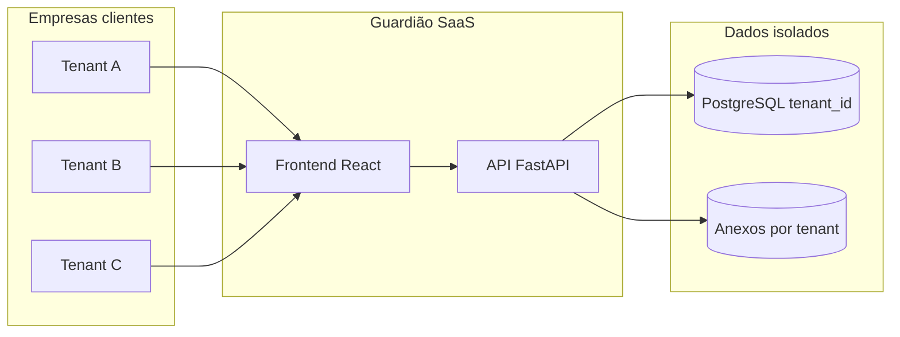

# 08 — Plano de disponibilização para o cliente final

Documento-mestre para **comercializar, implantar e operar** o Guardião de Pagamentos em várias empresas (multi-cliente), com base no que o repositório já entrega hoje e no que evoluir para produção.

> **Produto de referência:** MVP funcional em `frontend/`, `backend/`, `ai_models/` — perfis Analista, Gerente e Diretoria, IA no envio da remessa, trilha WORM e KPIs executivos (96 pagamentos analisados / 110 execuções IA / 24 fraudes ML na demo padrão).

---

## 1. O que você está oferecendo (fundamentado no projeto)

| Capacidade | Já existe no código | Onde validar |
|------------|---------------------|--------------|
| Remessas com vários pagamentos | Sim | `backend/app/routers/remessas.py`, tela Analista |
| IA no **envio** (não a cada clique) | Sim | `backend/app/services/ia_analise.py`, `docs/03-fluxo-ia.md` |
| XGBoost anti-fraude | Sim | `ai_models/`, `backend/app/services/fraud_engine.py` |
| Parecer GenAI (Ollama ou template) | Sim | `backend/app/services/genai_audit.py` |
| Dupla aprovação Analista → Gerente | Sim | `GUIA_UTILIZACAO.md` |
| Dashboard Diretoria (KPIs + gráficos) | Sim | `frontend/src/pages/Diretoria.tsx` |
| Histórico IA por pagamento (PAY-XXXXXX) | Sim | `GET /dashboard/historico-controle-ia` |
| Trilha de auditoria WORM | Sim | `audit_logs`, `GET /dashboard/auditoria` |
| PJ/PF não cadastrado, pontos de atenção | Sim | Endpoints em `dashboard.py` |
| Catálogo de cenários de fraude (demo) | Sim | `backend/app/seed_cenarios_fraude.py` |
| Deploy UI sem backend (demo) | Sim | `netlify.toml`, `frontend/public/demoSnapshot.json` |
| Login / multi-empresa / SSO | **Não** (roadmap) | Ver [06 — Roadmap](06-roadmap-produto-para-producao.md) |
| PostgreSQL multi-tenant | **Não** (roadmap) | Ver [03 — Arquitetura](03-arquitetura-multi-cliente-e-infraestrutura.md) |

**Mensagem comercial honesta:** venda **governança e IA assistiva** sobre contas a pagar; não substitui ERP nem internet banking.

---

## 2. Modelo de entrega: como várias empresas usam ao mesmo tempo

### Opção A — SaaS multi-tenant (recomendado para escala)

Uma instância da aplicação atende **N empresas**; cada uma é um **tenant** (CNPJ).

| Regra | Implementação futura |
|-------|----------------------|
| Isolamento lógico | Coluna `tenant_id` em remessas, pagamentos, cadastros, `audit_logs` |
| Isolamento de acesso | JWT com `tenant_id` + papel (`analista`, `gerente`, `diretoria`, `admin`) |
| Limites por plano | Middleware: pagamentos/mês, usuários ativos |
| URL | `app.guardiao.com.br` + login (subdomínio por tenant é opcional Enterprise) |

Detalhes técnicos: [03 — Arquitetura multi-cliente](03-arquitetura-multi-cliente-e-infraestrutura.md).

### Opção B — Instância dedicada por cliente (Enterprise)

Um deploy (API + banco + storage) **por empresa**. Maior custo, menor risco percebido (dados “físicos” separados). Indicado para bancos, saúde ou contratos que exijam ambiente isolado.

### Opção C — Piloto on-premise / VPC do cliente

API e banco na infraestrutura do cliente; você entrega imagem Docker e playbook. Receita: licença anual + suporte. Exige equipe de implantação.

**Para começar com 1–5 clientes:** Opção A em PostgreSQL gerenciado (Neon, Supabase, RDS) + S3/R2 para anexos.

---

## 3. Armazenamento — o que guardar, onde e por quanto tempo

### 3.1 Tipos de dado no sistema atual

| Tipo | Hoje (MVP) | Produção recomendada | Volume estimado (500 pag/mês) |
|------|------------|----------------------|-------------------------------|
| Cadastros (fornecedor, colaborador, conta) | SQLite | PostgreSQL | < 10 MB |
| Remessas e pagamentos | SQLite | PostgreSQL | ~50–200 MB/ano |
| Análises IA (`PagamentoAnaliseIA`) | SQLite | PostgreSQL | ~2× pagamentos |
| Auditoria WORM | SQLite | PostgreSQL append-only | ~500 KB–5 MB/mês |
| Anexos (NF, holerite) | Disco `uploads/` | Object storage privado | 2–20 GB/ano |
| Modelo ML (`.pkl`) | Arquivo no servidor | Artefato versionado por release | < 5 MB |
| Snapshot demo (Netlify) | `/demoSnapshot.json` (pasta `public/`) | Não usar em produção | ~1 MB |

### 3.2 Dimensionamento inicial (3–10 clientes PME)

| Recurso | Especificação mínima | Observação |
|---------|---------------------|------------|
| PostgreSQL | 10–20 GB, backup diário | Cresce com histórico e anexos metadata |
| Object storage | 50 GB + lifecycle | PDFs de NF; política de expurgo pós-contrato |
| API | 1–2 vCPU, 1–2 GB RAM | Picos no envio de remessa (IA em lote) |
| CDN frontend | Netlify/Vercel | Estático; `VITE_API_URL` por ambiente |

### 3.3 Política de retenção (contrato + LGPD)

| Dado | Retenção ativa | Após cancelamento |
|------|----------------|-------------------|
| Pagamentos e análises IA | Vigência do contrato | Export 30 dias; exclusão 90 dias |
| Audit logs | 5 anos (ajustável) | Anonimizar ou manter se lei exigir |
| Anexos | Ligado ao pagamento | Delete com pagamento |
| Backups | 30–90 dias | Expurgo automático |

Detalhes jurídicos: [04 — Segurança e LGPD](04-seguranca-compliance-e-lgpd.md).

---

## 4. LGPD — como atender o cliente final

| Papel | Responsável |
|-------|-------------|
| **Controlador** | Empresa contratante (dados de fornecedores, colaboradores, pagamentos) |
| **Operador** | Você (provedor do Guardião) |

### Pacote mínimo para fechar contrato B2B

1. **Termos de Uso** — licença SaaS, limites, IA assistiva (sem decisão autônoma de pagamento).
2. **Política de Privacidade** — dados tratados, bases legais, contato do encarregado.
3. **DPA (Acordo de Tratamento de Dados)** — anexo ao contrato; subprocessadores (cloud, GenAI).
4. **Registro de operações (ROPA)** — modelo por tenant sob demanda.
5. **Canal do titular** — `privacidade@seudominio.com.br`; SLA 15 dias úteis.

### Controles já alinhados ao produto

| Controle | Evidência no projeto |
|----------|----------------------|
| Trilha de quem fez o quê | `audit_logs`, ações `remessa_liberada`, `ia_analise_concluida` |
| Versionamento de análise IA | `PagamentoAnaliseIA.versao`, `triggered_by` |
| Minimização | IA só no envio; não enviar dados supérfluos ao LLM |
| Direito de acesso | Export CSV/JSON (implementar endpoint admin) |

### GenAI e subprocessador

- Se usar **Ollama local** no cliente: dados não saem da rede dele.
- Se usar **API cloud** (OpenAI, etc.): incluir no DPA; mascarar CPF/CNPJ no prompt quando possível.
- Fallback **template** já existe — reduz dependência e risco de vazamento.

---

## 5. Funcionalidades por plano (o que vender)

Matriz alinhada ao código atual e roadmap:

| Funcionalidade | Starter | Professional | Enterprise |
|----------------|---------|--------------|------------|
| Perfis Analista + Gerente | Sim | Sim | Sim |
| Perfil Diretoria | — | Sim | Sim |
| Pagamentos/mês | 50 | 500 | Negociado |
| IA XGBoost + heurísticas | Sim | Sim | Sim |
| GenAI parecer | Template | API/Ollama | Dedicado |
| Histórico 6+ meses | 90 dias | 2 anos | Custom |
| API leitura KPIs | — | Sim | Sim + webhooks |
| SSO / MFA | — | — | Sim |
| SLA uptime | 99% | 99,5% | 99,9% |
| Ambiente dedicado | — | — | Opcional |

Preços de referência: [02 — Modelo de negócios](02-modelo-de-negocios-e-precificacao.md).

---

## 6. Jornada comercial — do primeiro contato ao go-live

### Fase 1 — Pré-venda (1–2 semanas)

| Etapa | Ação | Material do repo |
|-------|------|------------------|
| Qualificação | ICP: 20–500 pag/mês, dupla aprovação | [01 — Visão](01-visao-e-proposta-de-valor.md) |
| Demo 20 min | Home → Analista → Gerente → Diretoria | [05-apresentacao.md](../05-apresentacao.md), Pitch PDF |
| Prova técnica | Mostrar PAY-XXXXXX, fraude ML, devolução | Catálogo MBA no seed |
| Proposta | Plano + setup + DPA | [02 — Precificação](02-modelo-de-negocios-e-precificacao.md) |

**Demo online:** Netlify (`VITE_DEMO_MODE=true`) — mesmos KPIs do local via `/demoSnapshot.json` (96/110/24).  
**Demo com IA real:** backend local ou API hospedada + `VITE_API_URL`.

### Fase 2 — Piloto (30 dias)

| Entregável | Critério de sucesso |
|------------|---------------------|
| Tenant configurado | Cadastros reais (top 20 fornecedores) |
| 2 analistas + 1 gerente treinados | ≥ 80% remessas via sistema |
| Diretoria acessa KPIs | Pelo menos 1 reunião com painel |
| Métricas | Tempo de ciclo remessa ↓; zero incidente de vazamento |

### Fase 3 — Contrato e implantação (30–60 dias)

Checklist completo: [07 — Implantação por cliente](07-implantacao-por-cliente.md).

Resumo:

1. Assinatura + DPA + pedido de compra.
2. Ambiente produção (PostgreSQL, S3, API, frontend).
3. Migração cadastros (CSV ou integração ERP fase 2).
4. Treinamento por perfil — [05 — Operação e treinamento](05-operacao-suporte-e-treinamento.md).
5. Go-live com suporte acompanhado (2 semanas).
6. QBR trimestral (KPIs, fraudes, melhorias).

### Fase 4 — Operação contínua

| Atividade | Frequência |
|-----------|------------|
| Suporte N1 (acesso, dúvidas) | Diário |
| Monitoramento uptime/erros | 24×7 alerta |
| Backup restore test | Trimestral |
| Retreino ML (opcional) | Anual ou após incidente |
| Atualização de produto | Release quinzenal/mensal |

---

## 7. Roadmap técnico mínimo antes do 1º cliente pagante

Prioridade derivada do gap entre MVP e multi-empresa:

| # | Item | Esforço | Impacto comercial |
|---|------|---------|-------------------|
| 1 | Autenticação (usuário/senha ou SSO) | Alto | Obrigatório |
| 2 | `tenant_id` + migração PostgreSQL | Alto | Multi-empresa |
| 3 | Anexos em S3 com URL assinada | Médio | LGPD + escala |
| 4 | HTTPS + secrets + backup automático | Médio | Confiança |
| 5 | Export de dados (portabilidade) | Médio | LGPD |
| 6 | Rate limit e limites por plano | Baixo | Monetização |
| 7 | Monitoramento (Sentry, uptime) | Baixo | SLA |

Detalhamento: [06 — Roadmap produto](06-roadmap-produto-para-producao.md).

---

## 8. Equipe e papéis mínimos

| Papel | Responsabilidade |
|-------|------------------|
| **Você / fundador** | Vendas, produto, arquitetura |
| **Dev backend** | API, tenant, integrações |
| **Dev frontend** | UX, painéis, deploy |
| **CS / implantação** | Onboarding, treinamento, N1 |
| **Jurídico (parceiro)** | Contrato, DPA, LGPD |
| **Suporte (terceirizável)** | N1 após playbook |

Com 3–5 clientes Professional, 1 dev full-stack + CS part-time é viável.

---

## 9. Indicadores de sucesso do negócio

| KPI comercial | Meta ano 1 |
|---------------|------------|
| Clientes pagantes | 5–15 |
| MRR | R$ 25k–75k |
| Churn mensal | < 3% |
| NPS pós go-live | ≥ 40 |
| Tempo médio implantação | < 45 dias |

| KPI do produto (já mensurável na demo) | Baseline seed |
|----------------------------------------|---------------|
| Pagamentos analisados (IA) | 96 |
| Execuções IA | 110 |
| Fraudes ML detectadas | 24 |

Esses números alimentam o discurso de valor na Diretoria — use o painel real na demo.

---

## 10. Checklist “pronto para vender”

- [ ] Demo estável (Netlify + snapshot alinhado ao backend)
- [ ] Pitch Deck e roteiro de apresentação
- [ ] Proposta comercial (3 planos) + modelo de contrato
- [ ] DPA e Política de Privacidade revisados por advogado
- [ ] Ambiente staging com PostgreSQL + backup
- [ ] Playbook de implantação 30–60 dias
- [ ] Canal de suporte (e-mail / ticket)
- [ ] Página de status ou monitoramento básico

---

## 11. Documentos relacionados

| Tema | Arquivo |
|------|---------|
| Visão e ICP | [01 — Visão](01-visao-e-proposta-de-valor.md) |
| Preços e contrato | [02 — Negócios](02-modelo-de-negocios-e-precificacao.md) |
| Infra e armazenamento | [03 — Arquitetura](03-arquitetura-multi-cliente-e-infraestrutura.md) |
| LGPD | [04 — Segurança](04-seguranca-compliance-e-lgpd.md) |
| Suporte e treinamento | [05 — Operação](05-operacao-suporte-e-treinamento.md) |
| Evolução do código | [06 — Roadmap](06-roadmap-produto-para-producao.md) |
| Go-live | [07 — Implantação](07-implantacao-por-cliente.md) |
| Técnico / arquitetura atual | [02-arquitetura.md](../02-arquitetura.md) |
| Paridade demo local × Netlify | [07-mapa-dados-demo.md](../07-mapa-dados-demo.md) |

---

## 12. Resumo em uma frase para o cliente final

> *"O Guardião de Pagamentos coloca IA e dupla aprovação no seu fluxo de contas a pagar — com trilha de auditoria para Compliance — sem trocar seu ERP ou banco."*

Para disponibilizar isso a **várias empresas**, você opera um **SaaS multi-tenant** (ou instâncias dedicadas Enterprise), com **dados em PostgreSQL e anexos em nuvem privada**, contratos **LGPD (DPA)** e planos por volume de pagamentos — evoluindo o MVP deste repositório conforme o roadmap da seção 7.
