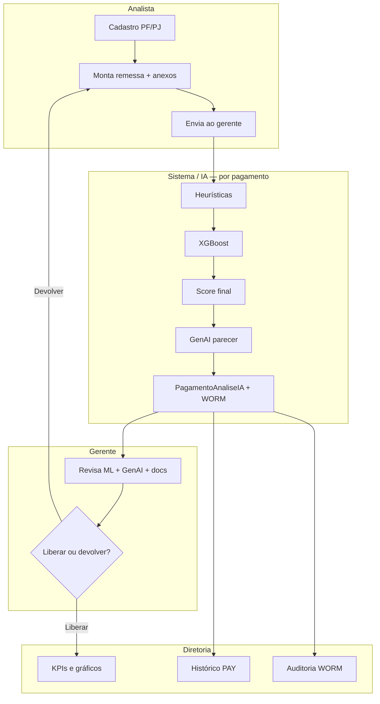

# 04 — Processo completo da IA no dia a dia

## Visão geral




---

## Fase 1 — Preparação (Analista)

| Passo | Ação | IA roda? |
|-------|------|----------|
| 1 | Cadastrar fornecedor PJ ou colaborador PF | Não (alertas de cadastro são separados) |
| 2 | Criar remessa e escolher conta bancária | Não |
| 3 | Adicionar pagamentos (valor, tipo, anexos) | **Não** — experiência rápida |
| 4 | Clicar **Enviar ao gerente** | **Sim** — IA em lote |

> **Regra de produto:** a IA só executa no envio (ou na reanálise do gerente), nunca a cada clique de “adicionar pagamento”.

---

## Fase 2 — Pipeline IA (automático)

Para **cada pagamento** da remessa, `executar_analise_ia_pagamento()` executa:

### 2.1 Conferência documental (GenAI / OCR simulado)

- Compara nome do arquivo com CNPJ/CPF e palavras-chave (`fake`, `ok`).
- Define `dados_conferem` (0 ou 1).

### 2.2 Heurísticas

- `regras_heuristicas()` → score 0–0,5 e lista de flags.
- Acréscimos por PJ/PF não cadastrado, salário, histórico do beneficiário.

### 2.3 XGBoost

- `extrair_features()` monta vetor de 6 features.
- `predict_proba()` → `ml_score`.
- Se `ml_score ≥ 0,55` → `ml_fraude_detectada = 1` + motivos.

### 2.4 Score final e nível

```text
risk_score = score_final(heurística, ml_score, dados_conferem)
+ ajustes se fraude ML ou não cadastrado
risk_level = baixo | medio | alto
```

### 2.5 Parecer GenAI

- Gera texto de auditoria (LLM ou template).
- Prefixa alertas se fraude ML, PF não cadastrada ou salário.

### 2.6 Persistência

- Atualiza tabela `pagamentos`.
- Insere linha em `pagamento_analises_ia` (versão N).
- Eventos em `audit_logs` (WORM).

---

## Fase 3 — Revisão humana (Gerente)

| Situação | O que o gerente vê | Ação |
|----------|-------------------|------|
| Risco alto | Badge `ALTO XX%`, motivos ML, parecer GenAI | Justificativa **obrigatória** para liberar |
| PJ/PF não cadastrado | Alerta amarelo | Devolver ou justificar |
| Documento divergente | `dados_conferem = 0` | Devolver para correção |
| Dúvida após correção | Botão **Nova análise IA** | `triggered_by = reanalise_gerente` |

**Devolução:** remessa volta ao analista (`devolvida_analista`) — IA **não** roda automaticamente até novo envio.

**Liberação:** dupla assinatura registrada; trilha WORM; saldo/conta atualizados conforme regras de negócio.

---

## Fase 4 — Governança (Diretoria)

| Módulo | O que consolida |
|--------|-----------------|
| Visão executiva | KPIs alinhados aos gráficos (pagamentos IA, fraudes ML, valor analisado) |
| Painéis IA | Quem disparou, evolução mensal, tipo de detecção |
| Histórico IA | PAY-XXXX por pagamento, versões, eventos Analista/Gerente |
| Alertas | Fraudes, não cadastrados, pontos de atenção |
| Auditoria | Trilha WORM completa |

Filtros **De / Até** aplicam o mesmo recorte em KPIs, gráficos e listas.

---

## Quando a IA executa novamente

| Evento | `triggered_by` | Perfil |
|--------|----------------|--------|
| Primeiro envio | `envio_gerente` | Analista |
| Reenvio após correção | `reenvio_gerente` | Analista |
| Reanálise manual | `reanalise_gerente` | Gerente |
| Seed catálogo | `catalogo_mba` | Sistema |

Cada execução incrementa `versao` em `PagamentoAnaliseIA` — o histórico **nunca sobrescreve** análises anteriores.

---

## Papel do modelo no controle interno

| Pergunta de auditoria | Onde responder |
|-----------------------|----------------|
| Por que este pagamento foi marcado? | `ml_motivos` + `heuristic_flags` |
| Qual versão da IA foi usada? | `PagamentoAnaliseIA.versao` + data |
| Quem aprovou apesar do alerta? | `audit_logs` + justificativa do gerente |
| O modelo estava carregado? | `GET /api/ml/status` |
| Houve fraude estatística? | `ml_fraude_detectada` e gráfico Diretoria |

---

## Modo demonstração (Netlify)

Sem backend, o frontend usa `demoResolver` com dados estáticos — o **processo lógico** é o mesmo, mas sem XGBoost real em runtime. Para validar o modelo de verdade, use backend local ou API hospedada com `VITE_API_URL`.
