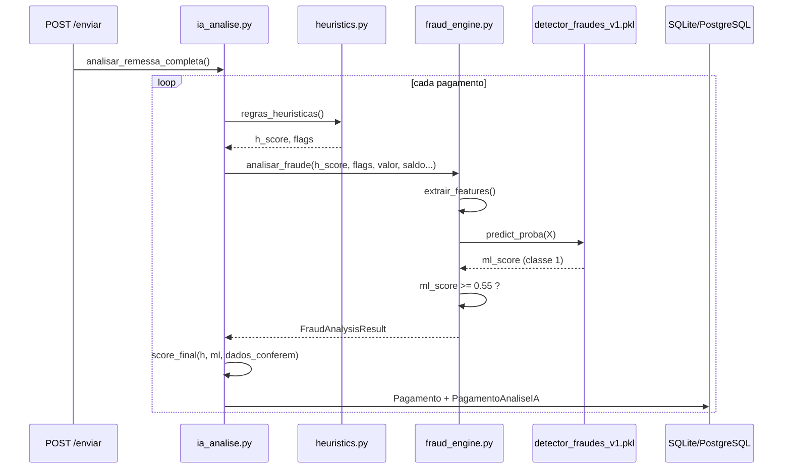

# 08 — Vínculo entre treinamento e atuação no Guardião de Pagamentos

Este documento fecha o ciclo **base de treino → artefato `.pkl` → inferência em produção → telas do sistema**, com justificativa técnica para cada elo. Complementa o [01 — Treinamento](01-treinamento-do-modelo.md) e o [04 — Processo completo](04-processo-completo-ia.md).

---

## 1. Resumo executivo

| Etapa | O quê | Onde no repositório |
|-------|--------|---------------------|
| **Base de treino** | Kaggle *Online Payments Fraud Detection* **ou** 60k registros sintéticos | `ai_models/train_model.py` |
| **Artefato** | `detector_fraudes_v1.pkl` + `model_metadata.json` | `ai_models/` |
| **Inferência** | Mesmas 6 features, mesma ordem, `predict_proba` | `backend/app/services/fraud_engine.py` |
| **Orquestração** | Heurísticas → ML → score final → GenAI | `backend/app/services/ia_analise.py` |
| **Gatilho** | Envio/reanálise de remessa | `POST /remessas/{id}/enviar` |
| **Exibição** | `ml_score`, `ml_fraude_detectada`, `ml_motivos`, badge de risco | Gerente + Diretoria |

**Modelo versionado no repositório hoje:** fonte `synthetic`, F1 ≈ **0,845**, AUC ≈ **0,939**, limiar **0,55** (ver `ai_models/model_metadata.json`).

---

## 2. Base de treinamento (origem dos dados)

### 2.1 Ordem de prioridade

```text
train_model.py::main()
    │
    ├─► load_kaggle_data()  ── sucesso ──► source = "kaggle"
    │
    └─► falha / indisponível ──► build_synthetic(60_000) ──► source = "synthetic"
```

| Fonte | Dataset | Registros | Referência |
|-------|---------|-----------|------------|
| **Kaggle (preferencial)** | [Online Payments Fraud Detection — Rupak Roy](https://www.kaggle.com/datasets/rupakroy/online-payments-fraud-detection-dataset) | até 200.000 | Transações com `isFraud`, saldos `oldbalanceOrg` / `newbalanceOrig`, `Amount` |
| **Sintético (fallback atual)** | Gerado em `build_synthetic()` com `random_state=42` | 60.000 | Rótulos derivados de regras alinhadas ao produto |

O campo `source` em `model_metadata.json` registra qual base foi usada no **último treino** (`synthetic` no artefato commitado).

### 2.2 Como o rótulo `isFraud` é definido no treino

#### Base sintética (regra explícita no código)

Um registro é marcado como fraude (`isFraud = 1`) quando **qualquer** condição abaixo é verdadeira **e** passa no sorteio de 75% (ruído para não ficar 100% determinístico):

| # | Condição no treino | Justificativa de negócio |
|---|-------------------|---------------------------|
| 1 | `amount > 120_000` | Pagamento de valor muito acima da média operacional |
| 2 | `balance_diff > amount * 0.08` | Inconsistência de saldo (padrão inspirado no Kaggle) |
| 3 | `velocity_proxy > 0.38` | Muitos pagamentos / velocity alta |
| 4 | `nao_cadastrado == 1` | Beneficiário fora da whitelist (~12% dos sintéticos) |
| 5 | `valor_sobre_saldo > 0.5` | Pagamento consome mais da metade do saldo |

Código: `ai_models/train_model.py`, função `build_synthetic()`, linhas 53–60.

#### Base Kaggle

O rótulo é a coluna **`isFraud`** (ou `isfraud`) do CSV original — fraude real observada no dataset de pagamentos online, sem regras adicionais do Guardião.

#### Preparação comum (`prepare()`)

- Normaliza nomes de colunas (`Amount` → `amount`).
- Deriva `balance_diff` e `valor_sobre_saldo` a partir de saldos Kaggle quando existirem.
- Garante as **6 features** na ordem fixa `FEATURES`.
- Target binário `y = isFraud`.

### 2.3 Treino e validação

| Passo | Método | Justificativa |
|-------|--------|---------------|
| Split | 80% treino / 20% teste, `stratify=y` | Manter proporção de fraudes |
| Balanceamento | SMOTE no treino (se `imbalanced-learn` instalado) | Reduz viés contra classe minoritária (fraude) |
| Algoritmo | XGBoost 150 árvores, depth 6, `scale_pos_weight=2` | Boa performance tabular; peso extra em fraudes |
| Métricas | F1 e AUC-ROC no hold-out | Registradas em `model_metadata.json` |

---

## 3. Ponte feature a feature: treino → runtime

O modelo **só recebe** as 6 colunas listadas em `FEATURES`. Em runtime, `fraud_engine.extrair_features()` calcula valores com a **mesma semântica**, a partir de dados reais do pagamento.

| Feature | No treino (sintético / Kaggle) | No Guardião (runtime) | Arquivo runtime |
|---------|--------------------------------|----------------------|-----------------|
| **amount** | Valor da transação / `Amount` | `pag.valor` | `fraud_engine.py` L71 |
| **balance_diff** | \|old−new\| saldo ou `amount * (0.02 + pct*0.2)` | `amount * (0.05 + pct_saldo * 0.15)` — proxy de inconsistência | L74–75 |
| **hour_risk** | Uniforme 0.05–0.45 (sint.) ou default 0.15 | 0.35 se hora ∉ [6h,22h]; 0.2 se amount>80k; senão 0.08 | L76–77 |
| **velocity_proxy** | Uniforme 0–0.5 (sint.) | `max(heuristic_score, _velocity_score(fornecedor_id))` — conta pagamentos do dia | L48–58, L78 |
| **nao_cadastrado** | Bernoulli ~12% (sint.) | `1.0` se `fornecedor_nao_cadastrado` ou `pf_nao_cadastrado` | L79 |
| **valor_sobre_saldo** | `amount / saldo_sim` | `amount / saldo_conta` (conta da remessa; default 500k) | L72–73, L87 |

**Ordem do vetor:** `meta["features"]` do JSON → `X = [[feats[f] for f in feature_names]]` — deve ser **idêntica** à ordem do treino.

### 3.1 Justificativa do alinhamento proposital

As regras sintéticas de `isFraud` foram desenhadas para refletir os mesmos riscos que o produto trata em `analisar_fraude()` **após** o `predict_proba`:

- Valor alto → motivo se `amount > 150_000`
- Liquidez → motivo se `valor_sobre_saldo > 0.4`
- Velocity → motivo se `velocity_proxy > 0.25`
- Não cadastrado → flags e motivos PJ/PF

Assim, o modelo aprende padrões **coerentes** com as regras explicáveis exibidas ao gerente, mesmo quando a base é sintética.

### 3.2 O que entra no XGBoost vs. o que fica fora

| Entra no `.pkl` (6 features) | Não entra no `.pkl` (mas afeta o sistema) |
|------------------------------|-------------------------------------------|
| amount, balance_diff, hour_risk, velocity_proxy, nao_cadastrado, valor_sobre_saldo | Benford, razão social, fracionamento (só heurística / motivos) |
| | `dados_conferem` (GenAI/OCR simulado) |
| | Ajustes pós-ML em `score_final()` e `risk += 0.1` se fraude |

> `valor_alto` é calculado em `extrair_features` mas **não** está em `FEATURES` — não alimenta o XGBoost; pode ser usado em evoluções futuras.

---

## 4. Inferência: do `.pkl` ao `ml_fraude_detectada`



### 4.1 Limiar e decisão ML

| Parâmetro | Treino | Runtime | Onde |
|-----------|--------|---------|------|
| Limiar fraude | 0.55 salvo em metadata | `THRESHOLD_FRAUDE = 0.55` | `fraud_engine.py` L22 |
| Classificação | `predict` no hold-out | `ml_fraude_detectada = (ml_score >= 0.55)` | L161 |
| Probabilidade | `predict_proba[:, 1]` | Idem | L117–119 |

**Justificativa do 55%:** equilíbrio entre sensibilidade a fraudes e volume de alertas para o gerente; calibrável por segmento (documentado no treinamento).

### 4.2 Fallback se o modelo não existir

Se `detector_fraudes_v1.pkl` estiver ausente, `analisar_fraude()` usa fórmula heurística (`amount/400k + velocity + ...`) e adiciona motivo *"treine o modelo..."*. O Guardião **continua funcionando**, mas sem o aprendizado do XGBoost.

---

## 5. Como o resultado ML se integra ao restante da IA

Após `analisar_fraude()`, em `executar_analise_ia_pagamento()`:

### 5.1 Score final (não é só o XGBoost)

```text
risk_score = 0.30 × heuristic_score + 0.50 × ml_score + (0.25 se NOT dados_conferem)
```

Se `ml_fraude_detectada`: `risk_score += 0.10` (teto 1.0).  
Se PJ/PF não cadastrado: `risk_score += 0.15`.

**Justificativa:** o gerente vê um **risco composto** — ML é 50% do peso, heurísticas 30%, documento 25% de penalidade. O XGBoost é a principal entrada, mas não a única.

### 5.2 GenAI e parecer

Se `ml_fraude_detectada`, o parecer GenAI é prefixado com:

```text
[⚠ MODELO ML — FRAUDE DETECTADA (XX%)]
• motivo 1
• motivo 2
...
```

Os `ml_motivos` vêm de:

1. Saída do XGBoost (`Modelo XGBoost classificou FRAUDE...`)
2. Regras pós-modelo em `analisar_fraude()` (valor, liquidez, velocity, cadastro)
3. Flags heurísticas repassadas (`Benford`, `ALERTA`, etc.)

### 5.3 Persistência

| Campo | Tabela | Versão |
|-------|--------|--------|
| Estado atual | `pagamentos` | Sobrescrito na última análise |
| Histórico | `pagamento_analises_ia` | `versao` incrementa; `triggered_by` registra origem |

---

## 6. Onde o usuário vê o efeito do treinamento

| Perfil | Elemento na UI | Origem do dado |
|--------|----------------|----------------|
| **Gerente** | Badge `ALTO XX%` | `risk_score` / `risk_level` (composto) |
| **Gerente** | Texto de motivos ML | `ml_motivos` |
| **Gerente** | Parecer GenAI com prefixo ML | `genai_parecer` |
| **Gerente** | Obrigatoriedade de justificativa | Regra API se fraude / não cadastrado |
| **Diretoria** | Card **Fraudes ML** | Contagem `ml_fraude_detectada = 1` |
| **Diretoria** | Gráfico tipo detecção | Segmento "Fraude ML" |
| **Diretoria** | Filtro "Somente fraudes ML" | Mesmo campo |

Sem o treinamento (sem `.pkl`), os mesmos campos existem, mas `ml_score` vem do fallback heurístico — comportamento documentado para auditoria.

---

## 7. Gatilhos que executam o modelo treinado

| Ação do usuário | Endpoint | `triggered_by` | Arquivo |
|-----------------|----------|----------------|---------|
| Analista envia remessa | `POST /remessas/{id}/enviar` | `envio_gerente` | `remessas.py` ~L346 |
| Analista reenvia após correção | mesmo endpoint | `reenvio_gerente` | conforme payload |
| Gerente nova análise IA | `POST /remessas/{id}/reanalisar-ia` | `reanalise_gerente` | ~L408 |
| Seed catálogo MBA | seed interno | `catalogo_mba` | `seed_cenarios_fraude.py` |

**Justificativa:** IA em lote no envio evita latência a cada pagamento e garante que gerente sempre revise snapshot consistente.

---

## 8. Rastreabilidade e auditoria

Para demonstrar que o modelo em produção é o treinado:

1. **`model_metadata.json`** — features, F1, AUC, `source`, limiar.
2. **`GET /api/ml/status`** — expõe `status_modelo()` (caminho do `.pkl`, features, fonte).
3. **`PagamentoAnaliseIA`** — guarda `ml_score`, `ml_motivos`, `versao`, data.
4. **`audit_logs`** — ações `remessa_enviada`, `catalogo_fraude_registrado`, etc.

Recomendação operacional: após cada `train_model.py`, commitar `.pkl` + `model_metadata.json` com tag de versão (ex.: `modelo-v1-synthetic-2026-05`).

---

## 9. Limitações honestas (importante para banca / cliente)

| Limitação | Impacto | Mitigação |
|-----------|---------|-----------|
| Base sintética no artefato atual | Generalização limitada a dados reais do cliente | Retreinar com Kaggle ou dados históricos anonimizados |
| Features são proxies | `balance_diff` não é extrato bancário real | Integração ERP/banco no roadmap |
| Limiar fixo 55% | Pode gerar FP ou FN por setor | Calibrar por tenant; métricas no piloto |
| ML não vê texto do documento | Fraude documental via `dados_conferem` + GenAI | OCR/LLM futuro |
| Heurísticas fora do `.pkl` | Comportamento dual (ML + regras) | Documentado neste vínculo |

---

## 10. Como reproduzir o encadeamento completo

```powershell
# 1. Treinar (gera pkl + metadata)
.\backend\venv_mba\Scripts\python.exe ai_models\train_model.py

# 2. Conferir metadata
Get-Content ai_models\model_metadata.json

# 3. Subir API
cd backend
..\backend\venv_mba\Scripts\uvicorn.exe app.main:app --port 8000

# 4. Status do modelo
curl http://127.0.0.1:8000/api/ml/status

# 5. Enviar remessa (dispara IA + XGBoost)
# Via UI Analista ou POST /api/remessas/{id}/enviar

# 6. Inspecionar pagamento no Gerente: ml_score, ml_motivos, genai_parecer
```

---

## 11. Referências no repositório

| Tópico | Documento / arquivo |
|--------|---------------------|
| Treinamento detalhado | [01-treinamento-do-modelo.md](01-treinamento-do-modelo.md) |
| Métricas F1/AUC | [02-resultados-e-metricas.md](02-resultados-e-metricas.md) |
| Códigos de detecção | [03-dicionario-de-deteccoes.md](03-dicionario-de-deteccoes.md) |
| Fluxo operacional | [04-processo-completo-ia.md](04-processo-completo-ia.md) |
| Script de treino | `ai_models/train_model.py` |
| Motor ML | `backend/app/services/fraud_engine.py` |
| Orquestração | `backend/app/services/ia_analise.py` |
| Metadados atuais | `ai_models/model_metadata.json` |
